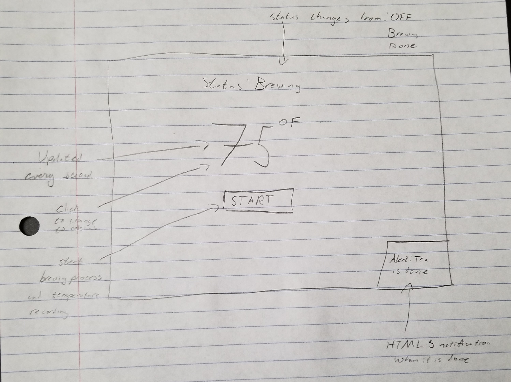
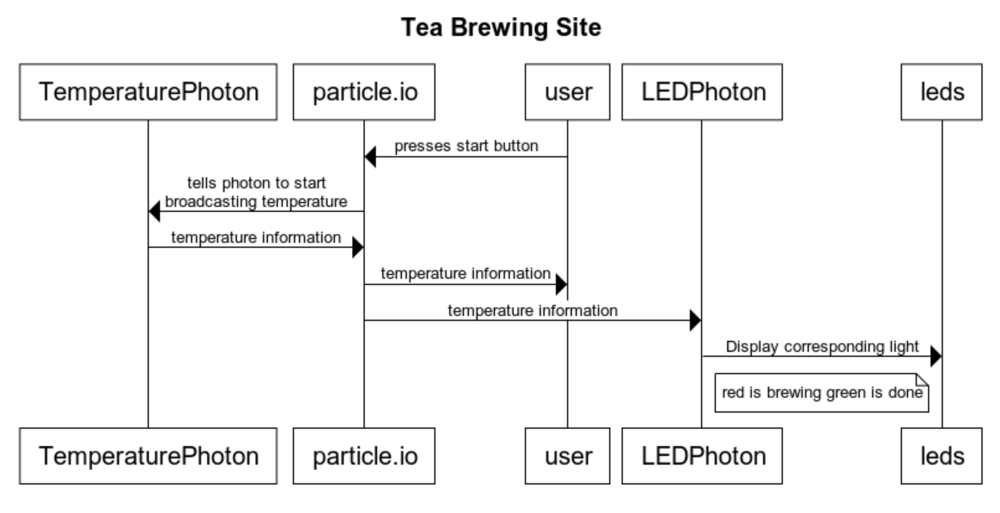

# 1. Description
When brewing tea and turning on the kettle, it is not uncommon to forget how long ago you turned on the kettle or if you turned it on at all. In areas where natural gas stoves are common, like St. Louis, this can lead to higher utility bills and fires. Our project aims to target tea lovers who are either forgetful, looking for ways to perfect their tea brewing, or both! Our project will involve two photons and a rasberry pi that is hosting a web page. One photon will have use the waterproof temperature sensor and broadcast an updated temperature to the particle stream. Once there, this information will be broadcasted both on the webpage and the other photon that is in another room. The second photon will control an LED that changes from red (not ready) to green (ready) once the desired tea temperature is reached. The hosted web page will make use of the HTML5 notification system to tell the user that their kettle is done boiling in addition to having the normal web page change to indicate that the tea is ready.

# 2. Hardware and Cloud Infrastructure Needed

## Hardware:
- 2 photons
- raspberry pi
- temperature sensor
- red and green LED

## Cloud Infrastructure:
- particle cloud services
- [nginx](https://www.nginx.com/) for static file management and port forwarding
- [gunicorn](https://gunicorn.org/) for server management

# 3. Unknowns and Challenges
Since we'll be using a temperature sensor to measure the temperature of the water/steam.  We'll need to find the maximum temperature
the sensor is capable of measuring to determine whether we should measure the temp of the water directly, or the steam that comes out
of the kettle.  
We'll also need to be mindful since our photon will be in close proximity to water, and we obviously don't want to get it wet.
# 4. User Stories & Usage Scenarios
Scenario if we measure the temperature of the water.
  1. The user places the kettle on the stove and places the temperature sensor inside of the kettle to record the temp of the water.
  2. The user begins boiling the water and moves into another room where they'll be waiting for it to finish.
  3. The user will open the application page that gives a visual alert when the tea is ready
  4. Once the temperature sensor reads that the tea is 100 degrees C, the page will be updated and alert the user.
  5. The user now goes to get their tea.

Scenario if we Measure the temperature of the steam.
  1. The user places the kettle on the stove and places the temperature sensor in front of the kettle spout.
  2. The user begins boiling the water and moves into another room where they'll be waiting for it to finish.
  3. The user will open the application page that gives a visual alert when the tea is ready
  4. When the tea boils, steam will come out of the spout, and the temp read by the sensor will spike.  This spike will let the page be updated to alert the user.
  5. The user now goes to get their tea.
# 5. Paper Prototypes

# 6. Implementation: Sequence Diagrams

# 7. Plan and Schedule

## Weekly Schedule / Progress

| Week End     | Deliverables & Accomplishments |
|:-------------|:-------------------------------|
| By Nov 16    |web server setup|
| By Nov. 23   |general application page|
| By Nov. 30   |photons sending data|
| Dec. 3       |  Complete Project Due!         |

## Group Member Responsibilities (Groups only)

| Name         | Responsibilities |
|:-------------|:-----------------|
|          Elijah|    Web server stuff      |
|      Alex   |        hardware|

## Times Reserved for Project Work

Fill in a schedule of times reserved for the project.  If you can't set regular weekly times, create a schedule based on specific days.

| Week Day | Times | Who (if on a team) |
|:---------|:------|--------------------|
| Monday   |    6-midnight |           both        |
| Tuesday  |  6-midnight|    both              |
| Wednesday|       |                    |
| Thursday |       |                    |
| Friday   | 6-midnight |    both              |
| Saturday |       |                    |
| Sunday   |       |                     |

## Bonus Credit
Our website will actually be hosted and as a result, accessible everywhere. Although you should really be at home when you have the kettle running. Nginx will handle static files and port forwarding and gunicorn is a python based web server. This will all be hosted on a raspberry pi.
